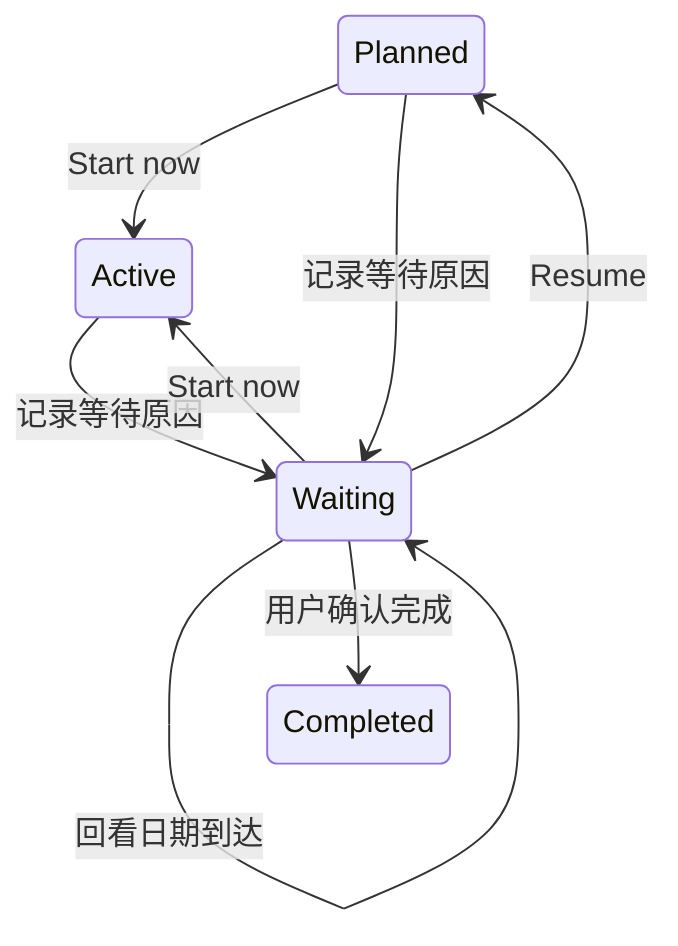

# Time Ledger 日常工作闭环

日期：2026-09-16  
状态：Today、等待、Review、Inbox 整理和项目下一步已实现；验收结果见第 8、9 节  
适用产品：原生 macOS Time Ledger

## 1. 这一轮解决什么问题

用户早上已经有了计划，中途却收到急事、等不到回复，晚上又留下几件未完成任务。Stash 应帮助用户调整承诺，保留下一步，并把遗留工作安排到合适的时间。

主要使用流程：

收集任务 → 确认今天 → 中途调整或等待 → 日终整理 → 每周选择下一步。

先完成 Today 调整、任务等待、Review，再完成 Inbox 连续整理和项目目标管理。以下第 4–8 节保留首批功能约定，第 9 节记录后续交付。

沿用 Today、Inbox、Upcoming、Projects、Review 五个入口。操作放在已有任务行、检查器和 Review 内。交互文案延续应用现有英文，本文以中文说明行为。

本文是 `SPEC_stash_native_mvp.md` 的日常任务流程扩展。当前原生实现以本文约定的预算与主动调整行为为准。Agent 的现行边界参考 `SPEC_stash_keepline_integration_v1.md`。

## 2. 当前能力与新增内容

以下基线来自本地代码，不代表本轮重新执行过运行验收。

| 环节 | 已有能力与代码 | 本轮新增 |
|---|---|---|
| 今日计划 | `DailyPlanner.swift` 按状态、日期、优先级和年龄选任务；`LedgerStore.swift` 保存当天顺序和锁定状态 | 明确时间余量，主动插入或替换任务，保持无关任务的顺序 |
| 任务调整 | `DetailRail.swift` 有 Start now、Move to today/tomorrow、Defer three days | 等待原因、回看日期、解除等待 |
| 复盘 | `DestinationViews.swift` 的 Review 展示今日完成、延期和废纸篓 | 当日未完成整理、按周回看完成、安排下周、Markdown 导出 |
| 保存 | `WorkspaceRepository.swift` 原子保存 workspace JSON，并保留前一份备份 | 新增字段沿用同一持久化流程；保存失败仍在原入口可见 |

现有规划器会先填满 minimumTasks，再考虑 minuteBudget；因此当前预算不是硬上限。现有 Today 总时长还包含已完成任务。新界面必须区分“今日计划总量”和“未完成任务预计用时”。

## 3. 一个完整使用案例

早上，用户看到今天六件任务，预计四小时。中午完成两件，临时收到一个四十五分钟的线上问题。

1. 用户从任务检查器选择加入今天，新任务进入列表，原有任务顺序保持。
2. 用户查看剩余预计用时，决定把一件低优先级任务改到明天；只有选中的任务退出今天。
3. 一项发布任务需要同事给权限。用户选择等待，填写“等 Alex 开通发布权限”，设置周五回看。该任务退出执行列表。
4. 晚上从 Review 查看未完成任务，逐项选择明天、指定日期、继续保留或放入废纸篓。每项操作立即保存，不强迫清空列表。
5. 周末选择本周，按项目回看已完成任务，检查仍在等待的事项，为下一周选择具体日期，最后导出 Markdown。

整个流程在 Keepline 不可用时仍能完成。已有 Agent 完成建议继续由用户决定是否接受。

## 4. Today：计划可以主动调整

### 4.1 时间反馈

Today 顶部同时表达完成数、未完成预计用时、每日预算。例如 `2 of 6 done · 3h remaining`，下方显示 `5h planned / 4h daily budget · 1h over`。

“remaining”指未完成任务的估算总和，不代表真实工作计时或距离下班的时间。完成数使用当前计划内的任务；Review 的完成列表可以包含今天完成但不在计划内的任务。

每日预算与当天整个计划的估算总和比较，已完成任务仍占当天计划份额；完成一项不会凭空释放相同时间，诱导用户继续塞满今天。没有工时记录时不展示实际投入、节省时间、效率分数。

自动推荐先保留正在进行和用户明确选入的任务，再用剩余预算选取其他任务。最低任务数改为期望数量，预算不足时允许少于最低值，并显示原因；Settings 的说明同步更新。最高任务数仍限制自动推荐，用户主动选入可以超过它。

用户选入的任务导致超额时显示超出多少以及调整入口，不自动移走任何一项。没有候选能放进剩余预算时保持空位，提示用户查看其他任务或调整已有预算；不能把“有任务但今天放不下”显示成“没有任务”。

这一规则明确替代原 MVP “必须凑够五到八项”的约定，让今天可执行优先于数量达标。

### 4.2 加入今天

从任务检查器或任务菜单执行 `Move to today`。任务已在列表中时不重复加入；未在列表中时追加到现有未完成任务之后。

这是一项用户明确决定，因此锁定状态也允许加入；不会解除锁定或重排其他任务。加入后可以超过推荐任务数和时间预算，界面显示真实数量和超额。

`Start now` 使用同一加入行为，并保留当前应用一次仅有一个 active 任务的约定。已有 Active 转回 planned；启动 Agent 本身不等于用户选择 Start now。

### 4.3 替换与移出

用户可以把今天的一项任务改到明天或其他日期，再加入另一项可执行任务。被移出项清除今日 pin，加入项放在列表末尾，无关任务保持相对顺序。

除上述两步调整外，Today 的 `Adjust tasks` 中提供 `Replace…`。选择原任务的新执行日期（明天或以后），再搜索并选择接替任务；确认后原任务退出今天，新任务占据原位置。其他行和锁定状态保持不变。

候选只包含不在今天计划内的开放任务，等待任务必须先恢复。已安排未来日期的候选可以由用户明确改到今天，界面展示原安排。替换前显示变更后的估算总量和超额；新任务不会因替换自动变为 Active。

两项任务与计划在一次 workspace 更新中修改。保存失败后窗口保留日期和选中项，冻结已应用的选择并提供 `Retry save`，避免再次执行替换。确认前取消不修改任务；跨日或任务状态变化后，过期操作明确报错。

2026-09-17 核心检查已覆盖原位置、邻居顺序、锁定、已完成行、截止时间和 checklist／Agent 链接保留，错误候选与日期不修改数据，写入失败及重试，以及跨日拒绝。

隔离原生窗口验收通过：候选排除等待与今日任务，替换前正确显示超额和截止日期冲突；禁止测试目录写入后保留选择并提供 Retry save，恢复写入后保存成功，新任务保持原位置。最终 release 核心检查、内存集成检查及签名校验通过。已更新本地应用并在后台启动，原有任务和项目记录保持不变；备份位于 `~/Library/Caches/Stash/today-replacement-b94rf07x/`。

改期只修改执行安排，保留 dueAt 截止时间。把执行日安排在截止日之后时展示日期冲突，由用户决定。

### 4.4 锁定与跨日

- 锁定阻止自动重新选取和排序，允许用户明确加入、改期、等待、完成或删除。
- 普通 Capture 不挤入锁定计划。
- 当天主动移出的任务不能因改标题或一次刷新立即被选回来；有未来执行日期的普通任务在该日期前不进入自动推荐，截止临近在 Upcoming 中展示。
- 解锁后 Replan 可以重新计算候选；未来执行日期和等待状态仍受尊重。
- 次日创建新的未锁定计划；昨天的 Today pin 清除，未完成任务仍按实际执行日期、截止日期、优先级和 Active 状态重新参与推荐。当天的主动调整不会变成永久固定顺序。
- 应用过午夜持续打开或从休眠返回时也执行同样的跨日行为。调整弹窗打开期间发生跨日，保留草稿并提示重新确认当天日期，不能把昨天的草稿写成今天的锁定计划。

### 4.5 界面结构

Today 保留现有中央列表，顶部最多两行说明。选中一项时在右侧检查器编辑日期与等待状态，避免每行铺满按钮。

```text
TODAY                                      [Lock today] [Replan]
Wednesday, September 16                    2 of 6 done · 3h remaining
5h planned / 4h daily budget · 1h over       [Adjust tasks]
────────────────────────────────────────────────────────────────────
✓ 完成的任务                               保留当日进度
▶ 当前任务                                 下一步 checklist 在右栏
  待执行任务                               选中后改期 / 等待
  刚主动加入的急事                         Added to today
```

`Adjust tasks` 进入当前列表的操作态，显示未完成项的 `Tomorrow` 和 `Choose date…`；支持 Escape 退出，不自动批量推迟任何任务。完成列表和任务检查器不切换到另一套数据。

## 5. 受阻任务：记录等待，不强迫猜原因

任务检查器新增 `Waiting…`。表单包含一条自由文本“在等什么”和可选回看日期，例如“等 Alex 开通权限，周五再问”。原因必填，回看日期按本地日历选择今天或以后。

保存后的行为：

- 任务进入 waiting 状态，保留 notes、project、dueAt、checklist 和 Agent 链接。
- 清除 Today pin，并从当天计划移出；正在进行的任务不继续显示为当前执行。
- 自动规划始终排除 waiting；回看日期到达仅意味着该检查了，不意味着外部阻塞已经解决。
- Review 展示等待任务，注明等待原因和回看日期；到期项优先展示，没有日期的事项仍可见。
- `Resume` 解除等待并恢复 planned，不自动启动任务；`Move to today` 和 `Start now` 表达用户主动解除等待并执行。
- 完成、丢弃仍由用户主动操作；修改日期或收到 Agent 活动不能自行解除等待。

等待表单的取消和 Escape 不修改任务。保存成功后显示原因摘要和 `Review waiting…` / `Resume`；保存失败时表单保持打开，原因和日期不丢失。空白原因在表单中明确提示，避免创建一个无法理解的 Waiting 标记。

已完成任务不提供等待入口。循环任务被标记等待时，只作用于当前实例；下次完成产生的新实例沿用原循环规则，不复制等待原因。放入废纸篓后再恢复的任务恢复原等待状态和说明。



其他受阻情况复用已有动作。没时间就改期，任务太大就补充 checklist 下一步，不再重要就移入可恢复的废纸篓。不增加固定原因分类、依赖图或自动追问 Agent。

## 6. Review：先收尾，再安排

### 6.1 日终整理

Review 内提供 Today / Week 切换，默认 Today。

Today 内容依次为：今日完成、今日计划中仍未完成、等待回看、已暂缓。废纸篓保留独立入口或折叠区域，避免占据主要复盘位置。

未完成项支持选中查看、明天、指定日期、等待和移入废纸篓。继续保留无需写一次无意义状态。每次操作显示真实保存结果，失败时保留选择和输入。没有自动日终弹窗，也不要求用户每天“打卡完成复盘”。

### 6.2 周回看

Week 默认当前周，可以查看前一周、后一周和回到本周。周区间使用原生 store 的本地 Calendar，明确显示起止日期；跨月和跨年正常处理，不用固定秒数计算一天或一周。

完成列表来自当前仍为 completed 且 completedAt 落入所选半开区间的任务，按项目分组，无项目单独一组。循环任务的不同实例按不同任务计数；重开的任务不再计入完成。

等待、延期和未完成区域明确标为“当前仍待处理”，它们是当前任务状态，不冒充所选历史周的快照。第一版不展示历史承诺完成率、延期次数或计划兑现率，因为当前 workspace 没有保存这些事实。

切换到历史周时，标题说明“完成记录按所选周筛选，待处理事项为当前状态”。永久删除的任务不在记录中，界面不把当前数据呈现为不可变的审计账本。空周显示明确日期和“这一周没有已完成任务”，仍可查看当前等待事项。

### 6.3 安排下周

在 Week 中从当前未完成事项选择任务，设置所选周之后一周的具体执行日期。已存在安排时显示旧日期，只有用户确认后修改。操作复用任务改期，不建立第二份周计划。

等待任务可以调整回看日期；若要安排执行，需要先明确 Resume。安排下周不会改变今天无关任务的锁定或顺序，也不移动任务截止时间。

历史周只用于回看；安排区域提供 `Return to this week to plan`，避免用户把当前任务排进过去。当前周或未来周可以安排其下一周。导出始终按所选周的“下一周”区间展示现有数据，不把当前安排伪装成历史事实。

### 6.4 导出

导出当前所选周的 Markdown，包含区间、按项目完成项、当前等待事项和接下来一周已安排任务。区分已完成事实和当前状态。由系统保存面板选择路径，取消无副作用；写入失败显示错误并允许重试。

导出包含用户主动维护的任务信息，不附带完整 Agent transcript。用户没有写总结时不生成虚构的总结段落。

### 6.5 界面结构

```text
REVIEW                 [Today | Week]        [Export week…]
Sep 14 – Sep 20         [Previous] [This week] [Next]
────────────────────────────────────────────────────────────
COMPLETED THIS WEEK
  Stash             3 completed              点选查看任务
  Personal          1 completed
CURRENTLY OPEN                              明确当前状态
  仍需安排的工作                            [Choose date…]
WAITING
  等 Alex 开权限 · Review Sep 18              [Review waiting…]
NEXT WEEK · Sep 21 – Sep 27                  已有安排预览
  Monday            修正文档
```

Today 页签不显示周导航和周导出；Week 页签切换时保留各自选择。单项操作立即保存，页签切换不自动提交日期草稿。短暂返回任务详情后保留所选周和滚动位置。

## 7. 最小实现边界

继续使用现有 SwiftUI、StashCore、LedgerStore 和 Codable workspace。

| 数据 | 处理 |
|---|---|
| 今日顺序和锁定 | 使用现有 DailyPlan.entries / isLocked |
| 默认每日预算 | 使用现有 PlanningPreferences.minuteBudget |
| 未完成预计用时 | 从当前计划任务计算，不持久化第二份计数 |
| 等待 | TaskStatus 增加 waiting，任务保存自由文本等待说明和可选回看日期 |
| 周完成、下周安排 | 使用现有 completedAt / scheduledFor / projectID |
| 周区间和操作草稿 | 页面状态，不创建数据库或后台任务 |

新字段采用清晰的原生模型表达，延续现有加载和保存入口。不添加新的迁移框架、兼容服务、审计日志或历史回填；旧数据缺失的新事实不能被推断补造。

本轮不接入 Remem、ccstats、同步、日历服务或新的 AI provider，不改变 Keepline 的服务归属。以上整合路线独立讨论，不作为日常任务功能的前置工程。

## 8. 交付顺序与验收

| 批次 | 用户能获得的结果 | 必须验证 |
|---|---|---|
| A：Today 调整 | 锁定后仍可主动加入，真实看到未完成预计用时，改期后任务不会自己回来 | 加入幂等；其他行顺序和锁定不变；预算不足允许低于最低任务数；未来安排不提前进入；完成后剩余用时更新；跨日重新规划 |
| B：等待 | 记住在等什么，在合适日期回看，解除后继续 | waiting 排除于自动规划；回看日期不自动解除；状态和原因重启保存；dueAt、checklist、Agent 链接保留 |
| C：Review | 日终处理遗留，按周回看并把工作安排到下周，导出 | 所选周过滤、跨年和时区边界；重开与循环实例；改期持久化；导出与界面区间一致；保存失败可见 |

核心检查扩展现有 `Sources/StashCoreChecks`，使用注入时钟和隔离 workspace，不接触用户工作文件。按原生 README 运行：

```sh
cd native/prototypes/time-ledger
swift run StashCoreChecks
swift run StashIntegrationChecks
swift build -c release
```

UI 验收使用隔离的 `STASH_WORKSPACE_PATH`，实际覆盖窄窗口、系统保存面板、空周、等待输入校验和保存失败重试；跨日使用注入时钟的核心检查。按现有打包脚本验证发布包时不得替换正在运行的应用。

验收使用隔离数据，未把 QA 任务写入用户工作文件。

| 交付物 | 当前状态 |
|---|---|
| 本轮产品行为、边界与验收规格 | 已按最小实现更新 |
| A：Today 调整 | 已实现，核心检查及原生操作验收通过 |
| B：等待 | 已实现，空原因、保存重试、持久化及循环任务检查通过 |
| C：Review | 已实现，日期边界、历史空周、安排下周及真实文件导出通过 |

### 2026-09-16 本地验收

- `swift run StashCoreChecks` 通过。新增检查覆盖预算优先、锁定后幂等加入、完成不释放估算预算、未来改期保留截止日期、等待到期不自动恢复、垃圾箱恢复、循环下一实例清除等待、跨日解锁与清除旧 pin、写入失败及重试。
- 周范围覆盖上海、洛杉矶、柏林，包含跨年和夏令时所在周；起点包含、终点排除，重开任务不计入完成；Markdown 特殊字符及日期区间检查通过。
- `swift run StashIntegrationChecks` 通过；打包二进制以 `STASH_KEEPLINE_E2E_BINARY` 运行隔离服务验收，完成建议、人工决定、重启恢复链路通过。
- 原生窗口使用独立 `STASH_WORKSPACE_PATH` 验收。在 Keepline 不可用时，锁定计划调整、等待记录、Review 和安排下周正常工作。
- UI 空等待原因显示错误且不关闭表单。通过临时禁止隔离目录写入，验证 Save schedule 失败后日期保留、表单仍打开；恢复写入后再次保存成功。
- 真实系统保存面板导出 `weekly-review.md`，文件中的完成区间、等待原因及下一周任务与界面和 workspace JSON 一致。
- 最终 release 构建的 `StashCoreChecks` 和应用签名校验通过；重启隔离应用后等待原因和下周日期仍在，1040 像素宽窗口的周回顾显示正常。
- 已更新 `/Applications/Stash Time Ledger.app` 并启动，启动前后 3 条原有任务记录完全一致；程序与数据备份位于 `~/Library/Caches/Stash/local-install-workflow-9rs3lzxi/`。
- 启动扫描超时已在后续修复：实际历史文件约 27 GB，隔离数据库完整扫描耗时 93 秒。Keepline 启动全量扫描上限改为 5 分钟，增量扫描仍为 30 秒；扫描日志记录模式、耗时和实际错误。真实安装包全量扫描耗时 77.287 秒，`scan.completed=true`，会话 API 返回 200，Agent Activity 已显示会话。12 项服务运行测试、类型检查和打包后的隔离集成检查通过。
- 本次服务修复位于相邻 `keepline/src/services/service-runtime.ts`；应用、原生任务与 Keepline 数据库备份保存在 `~/Library/Caches/Stash/scan-fix-zvd3opy4/`。安装启动后原有 3 条任务记录完全一致。
- 日常任务功能只改变原生任务流程；随后为修复启动超时修改了 Keepline 服务运行逻辑及对应测试。Web 源码没有修改。

实现入口为 `StashCore/LedgerReview.swift`、`StashTimeLedger/TaskPlanningActions.swift`、`StashTimeLedger/NativeReviewView.swift`，并扩展已有 planner、store、检查器和核心检查。表单由窗口承载，避免任务改期离开列表时丢失保存失败的输入。

## 9. Inbox 连续整理与项目下一步（已实现）

### Inbox 连续整理

- 从 `Organize Inbox…` 或任务行 `Organize…` 开始一批整理。当前选中任务优先，随后处理其余捕获任务。
- 同一窗口展示当前任务和剩余数量。可选 Today、具体 Date、Long term、Project only，并设置项目。
- Project only 必须选择实际存在的项目，只完成归类，不把任务加入 Today；原计划中其他任务顺序和锁定不变。
- `Save & next` 等待实际写入成功才进入下一条；失败时仍显示当前任务和原选择，支持重试。窗口关闭之前保存成功的任务不会撤回。
- 批次结束自动关闭。期间新增的捕获留在 Inbox，下一批再整理；已被其他操作处理的任务跳过。
- 项目、日期或长期归属变更同步到任务检查器，防止旧编辑草稿覆盖整理结果。

### 项目目标与下一步

- 项目增加可选的一句话目标，可在新建和编辑时维护；名称与目标保存失败保持表单和输入。
- 按已有任务事实分为可执行、等待、稍后和需要决定。未来执行日、暂缓期未到、未安排的长期任务不显示为当前可执行。
- 项目有可执行任务时，选择该任务后通过已有检查器 Start now / Move to today 决定执行。
- 没有可执行任务时，提示整理待决定项、查看稍后事项或检查等待原因；全部等待、已完成和空项目有不同说明。
- 不建立第二份项目任务清单，不增加里程碑、依赖图或自动完成项目。

### 验收

- 核心检查覆盖项目归类不承诺今天、非法项目不修改任务、失败后改变选择重试、具体日期与长期归属、目标序列化和重新加载，以及可执行／等待／完成／空项目区分。
- 使用隔离数据实测三条 Inbox 连续整理；暂时禁止隔离目录写入时，第一条保存失败仍保留当前任务、项目选择和数量。恢复写入后重试进入第二条，批次结束显示 Inbox zero。
- 项目页实测显示等待原因、完成数量和空项目提示；编辑目标后在列表中立即可见。
- 最终 release 核心检查和内存集成检查通过，应用签名校验通过。程序已更新到 `/Applications/Stash Time Ledger.app` 并启动，原有任务与项目记录保持不变；备份位于 `~/Library/Caches/Stash/inbox-projects-cwj8bm9i/`。

## 10. Agent 大历史库启动提速

2026-09-17 已在相邻 Keepline 实现跨扫描进程的会话摘要缓存。此前解析缓存仅保留在子进程内，每次重启都要重新读取全部历史 JSONL。

- 摘要写入 `KEEPLINE_HOME/session-summaries-v1.sqlite`，未变化文件可跨进程复用。首次建立缓存仍完整读取历史文件。
- 文件身份、大小、修改时间或变更时间变化时重新解析；解析期间继续增长的文件不写入缓存。工具调用详情按需读取完整记录。
- 只缓存 transcript 事实。每轮仍重新扫描进程、匹配会话并判断状态，启动期间继续等待真实同步结果，不把上次的运行状态当成当前事实。
- 缓存错误明确报告，不写成 transcript 损坏记录。解析语义变化需要递增缓存版本；缓存是派生数据，不是原生任务或会话数据库的替代品。

隔离数据库使用本机约 27 GB 历史进行实测：首次扫描 18,005 条会话耗时 85.04 秒；全新进程再次扫描耗时 4.03 秒，命中 18,000 条、重读变化记录 5 条，两种 runtime 均无扫描错误。摘要缓存约 260 MB。这是该机器上的观测结果，不承诺任意历史规模都在固定秒数内完成。

40 项相关测试通过，包含跨进程复用、两种 Agent 的详情读取与更新、mtime 恢复后的失效、解析期间增长、解析及缓存错误、服务运行和架构依赖检查。前后端类型检查、原生核心与内存集成检查、签名校验及打包服务的首次启动／重启完成建议检查通过。

本地应用已更新并在后台启动。安装包实测首次扫描 79.632 秒，重启扫描 3.687 秒（命中 18,003 条、重读 2 条）；从打开应用到服务就绪约 4.77 秒，会话 API 返回 200。原有 3 条任务与项目记录核对一致。应用和数据备份位于 `~/Library/Caches/Stash/startup-cache-v1jb1rjp/`，同目录保存两次启动的健康检查证据。

提交前已对齐 Keepline 最新主线，保留其全量扫描失败保护、启动重试与核对状态控制；56 项相关测试及类型检查通过。Stash 的隔离 hook 配置同步为 runtime 专属地址，打包服务的首次启动、缓存重启与完成建议验收重新通过。原生 CI 固定到 Keepline `8a9072eb97bbf50410839a01ecb3e3ce5c1f6d35`，并加入 `StashCoreChecks`。

## 11. 只调整今天预算

用户确认本轮优先补充当天可用时长。Today 的 `Today's budget…` 可选择继续使用默认预算，或以 30 分钟步长设置 0–16 小时的当天预算。0 表示今天没有可用于自动建议的时间。

- 预算覆盖保存在当前 `DailyPlan.minuteBudgetOverride`；默认规划设置保持独立。当天关闭、重开应用和 JSON 备份均保留覆盖，次日新计划自动恢复默认预算。
- 保存预算保留任务、已有顺序和锁定状态，只更新预算与超额提示。需要重新选择建议任务时，用户解锁并选择 `Replan`。
- 自动重算使用当天预算，并扣除当天计划中已完成任务的估算用时；Active 和用户主动加入的任务继续保留，即使超过预算。替换任务时的预算预览也使用当天预算。
- 当天有覆盖时，修改默认设置只改变默认值；选择 `Use default budget` 才解除当天覆盖。
- 保存失败显示错误并保留选择，`Retry save` 仅重试写入。跨日仍打开的旧编辑窗口拒绝把昨日选择写进新的一天。

核心检查覆盖默认值、当天覆盖、锁定保护、已完成与主动任务的预算处理、重新规划、恢复默认、零预算、备份与重启、失败重试和跨日拒绝。隔离原生窗口实测：4 小时任务改为 3 小时预算，显示超额 1 小时且锁定顺序保持；禁止测试目录写入时保留选择并显示重试入口，恢复写入后保存成功；解锁并重新规划后变为 2 小时 30 分钟的任务。

Release 构建、核心检查、内存及打包服务集成检查和签名校验通过。已更新本地应用并在后台启动，原有 3 条任务与项目记录核对一致。程序和数据备份位于 `~/Library/Caches/Stash/today-budget-qs5i9q30/`。

## 12. 后续保留项

今日任务单次替换入口与当天预算覆盖已实现，行为见第 4.3、11 节。Agent 首次建立摘要缓存仍需完整扫描；后续若继续优化首次扫描，应单独实测。实际计时和历史计划兑现率需要独立的真实使用需求，不在这轮增设数据结构。
